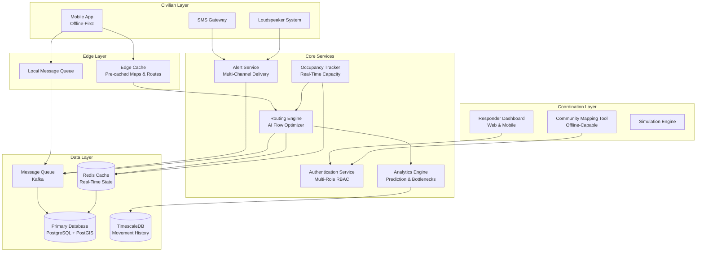
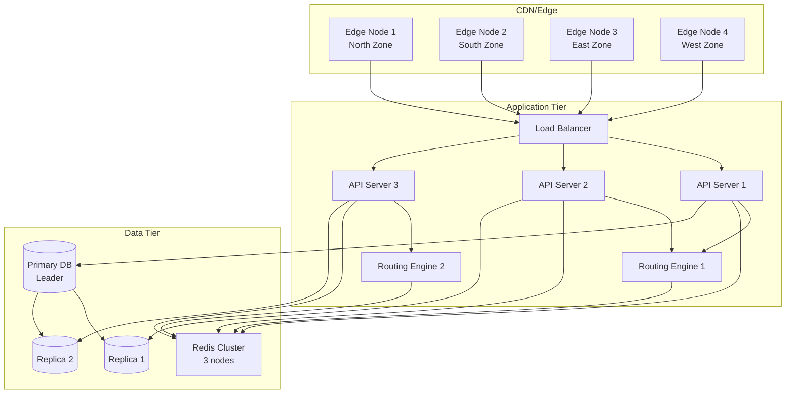

 # Design Document: Scramble Evacuation System

## Overview

The Scramble Evacuation System is a distributed, offline-first platform that coordinates large-scale urban evacuations through AI-powered routing, multi-channel communication, and real-time resource tracking. The system treats evacuation as a flow optimization problem, dynamically balancing civilian distribution across shelters and routes to prevent gridlock while accounting for individual accessibility needs and vulnerable populations.

### Design Goals

1. **Resilience**: Operate during infrastructure degradation with offline-first architecture
2. **Scale**: Support millions of concurrent users with sub-3-second routing responses
3. **Equity**: Ensure vulnerable populations receive prioritized, accessible guidance
4. **Coordination**: Enable real-time inter-agency collaboration without data silos
5. **Efficiency**: Minimize bandwidth usage (<500KB per evacuation event) for congested networks

### Key Constraints

- Sub-3-second routing response time for individual requests
- 60-second maximum alert delivery time for city-wide notifications
- 500KB maximum data usage per evacuation event in low-bandwidth mode
- Support for 5 languages (Kannada, Hindi, Tamil, Telugu, English)
- Real-time updates every 15-30 seconds for responder dashboards
- Offline operation with eventual consistency when connectivity restored

## Architecture

### System Architecture

The system follows a microservices architecture with edge computing capabilities for offline resilience:



### Deployment Architecture



## Components and Interfaces

### 1. Routing Engine

**Responsibility**: AI-powered flow optimization that assigns civilians to shelters and routes while preventing citywide gridlock.

**Key Algorithms**:
- Multi-objective optimization: minimize total evacuation time, balance shelter load, minimize route congestion
- Dynamic rerouting: triggered by congestion >80%, shelter capacity >90%, or manual route closures
- Constraint satisfaction: accessibility requirements, family grouping, vulnerable population priority

**Interfaces**:

```typescript
interface RoutingEngine {
  // Calculate initial route assignment for a civilian
  assignRoute(request: RouteRequest): Promise<RouteAssignment>;
  
  // Recalculate routes for affected civilians (triggered every 2 minutes or by events)
  recalculateRoutes(trigger: RecalculationTrigger): Promise<RouteUpdate[]>;
  
  // Get alternative routes when primary route is congested
  getAlternativeRoutes(civilianId: string, reason: RerouteReason): Promise<RouteAssignment>;
  
  // Predict bottlenecks in next 30 minutes
  predictBottlenecks(timeWindow: number): Promise<BottleneckPrediction[]>;
}

interface RouteRequest {
  civilianId: string;
  currentLocation: GeoPoint;
  accessibilityRequirements?: AccessibilityProfile;
  familyGroupIds?: string[];
  priority: 'standard' | 'vulnerable' | 'medical';
}

interface RouteAssignment {
  routeId: string;
  shelterId: string;
  waypoints: GeoPoint[];
  estimatedDuration: number; // seconds
  distance: number; // meters
  instructions: LocalizedInstruction[];
  alternativeRoutes: RouteOption[];
}

interface RecalculationTrigger {
  type: 'scheduled' | 'congestion' | 'capacity' | 'manual_closure';
  affectedArea?: BoundingBox;
  affectedShelterIds?: string[];
  affectedRouteIds?: string[];
}
```

**Performance Requirements**:
- Individual route calculation: <3 seconds (p99)
- Bulk recalculation (10,000 civilians): <30 seconds
- Bottleneck prediction: <5 seconds

### 2. Alert Service

**Responsibility**: Multi-channel delivery of evacuation alerts with language localization and delivery confirmation.

**Interfaces**:

```typescript
interface AlertService {
  // Send evacuation alert to a single civilian
  sendAlert(alert: EvacuationAlert): Promise<DeliveryStatus>;
  
  // Send alerts to all civilians in an area (city-wide or zone-specific)
  broadcastAlert(broadcast: BroadcastAlert): Promise<BroadcastStatus>;
  
  // Verify alert authenticity
  verifyAlert(alertId: string, verificationCode: string): Promise<boolean>;
  
  // Get delivery status for an alert
  getDeliveryStatus(alertId: string): Promise<DeliveryStatus>;
}

interface EvacuationAlert {
  alertId: string;
  civilianId: string;
  language: 'en' | 'hi' | 'kn' | 'ta' | 'te';
  channels: DeliveryChannel[];
  routeAssignment: RouteAssignment;
  priority: 'immediate' | 'high' | 'standard';
  signature: string; // Digital signature for verification
}

interface DeliveryChannel {
  type: 'push' | 'sms' | 'loudspeaker';
  config: ChannelConfig;
}

interface BroadcastAlert {
  broadcastId: string;
  targetArea: BoundingBox;
  message: LocalizedMessage;
  channels: DeliveryChannel[];
  estimatedRecipients: number;
}

interface DeliveryStatus {
  alertId: string;
  sentAt: Date;
  deliveredChannels: ChannelDeliveryStatus[];
  failedChannels: ChannelDeliveryStatus[];
  totalDeliveryTime: number; // milliseconds
}
```

**Performance Requirements**:
- City-wide alert delivery: <60 seconds for 1M civilians
- Individual alert delivery: <5 seconds
- SMS fallback latency: <10 seconds

### 3. Occupancy Tracker

**Responsibility**: Real-time monitoring of shelter capacity with predictive fill-time calculations.

**Interfaces**:

```typescript
interface OccupancyTracker {
  // Update occupancy when civilians check in
  updateOccupancy(shelterId: string, delta: number): Promise<OccupancyStatus>;
  
  // Get current occupancy for a shelter
  getOccupancy(shelterId: string): Promise<OccupancyStatus>;
  
  // Get occupancy for all shelters in an area
  getAreaOccupancy(area: BoundingBox): Promise<OccupancyStatus[]>;
  
  // Predict when shelter will reach capacity
  predictFillTime(shelterId: string): Promise<FillTimePrediction>;
  
  // Subscribe to occupancy threshold alerts
  subscribeToThresholds(shelterId: string, thresholds: number[]): EventStream<OccupancyAlert>;
}

interface OccupancyStatus {
  shelterId: string;
  currentOccupancy: number;
  maxCapacity: number;
  utilizationPercent: number;
  lastUpdated: Date;
  trend: 'increasing' | 'stable' | 'decreasing';
}

interface FillTimePrediction {
  shelterId: string;
  predictedFillTime: Date | null; // null if not expected to fill
  confidence: number; // 0-1
  currentAssignmentRate: number; // civilians per minute
}
```

**Performance Requirements**:
- Occupancy update latency: <500ms
- Update frequency: every 30 seconds
- Prediction accuracy: >85% within 15-minute window

### 4. Responder Dashboard

**Responsibility**: Real-time visualization and coordination interface for emergency responders across agencies.

**Interfaces**:

```typescript
interface ResponderDashboard {
  // Get real-time evacuation status
  getEvacuationStatus(cityId: string): Promise<EvacuationStatus>;
  
  // Get movement bottlenecks
  getBottlenecks(cityId: string): Promise<Bottleneck[]>;
  
  // Get resource gaps across shelters
  getResourceGaps(cityId: string): Promise<ResourceGap[]>;
  
  // Manually close a route or shelter
  closeResource(closure: ResourceClosure): Promise<void>;
  
  // Mark area as covered by agency
  markAreaCovered(coverage: AgencyCoverage): Promise<void>;
  
  // Get agency-specific view
  getAgencyView(agencyType: AgencyType): Promise<AgencyDashboard>;
}

interface EvacuationStatus {
  totalCivilians: number;
  evacuated: number;
  inTransit: number;
  notStarted: number;
  estimatedCompletionTime: Date;
  activeBottlenecks: number;
  criticalResourceGaps: number;
}

interface Bottleneck {
  location: GeoPoint;
  affectedRoutes: string[];
  flowRate: number; // civilians per minute
  expectedFlowRate: number;
  severity: 'low' | 'medium' | 'high' | 'critical';
  suggestedInterventions: string[];
}

interface ResourceGap {
  shelterId: string;
  resourceType: 'medical' | 'food' | 'water' | 'personnel' | 'supplies';
  currentAmount: number;
  requiredAmount: number;
  urgency: 'low' | 'medium' | 'high' | 'critical';
}

interface ResourceClosure {
  resourceType: 'route' | 'shelter';
  resourceId: string;
  reason: string;
  estimatedDuration?: number; // minutes
  responderId: string;
}

type AgencyType = 'ndrf' | 'police' | 'hospital' | 'ngo';
```

**Performance Requirements**:
- Dashboard update frequency: every 15 seconds
- Query response time: <2 seconds
- Mobile dashboard load time: <3 seconds

### 5. Community Mapping Tool

**Responsibility**: Pre-disaster mapping of vulnerable populations and informal settlements with offline capability.

**Interfaces**:

```typescript
interface CommunityMappingTool {
  // Add vulnerable population marker
  addVulnerableLocation(location: VulnerableLocation): Promise<string>;
  
  // Add informal settlement boundary
  addInformalSettlement(settlement: InformalSettlement): Promise<string>;
  
  // Add local landmark
  addLandmark(landmark: Landmark): Promise<string>;
  
  // Sync offline data when connectivity restored
  syncOfflineData(data: OfflineDataBatch): Promise<SyncResult>;
  
  // Get mapped data for an area
  getMappedData(area: BoundingBox): Promise<MappedData>;
}

interface VulnerableLocation {
  location: GeoPoint;
  residentCount: number;
  mobilityLimitations: string[];
  languagePreferences: string[];
  contactInfo: ContactInfo[];
  accessibilityNotes: string;
  mappedBy: string; // volunteer ID
}

interface InformalSettlement {
  boundary: GeoPolygon;
  estimatedPopulation: number;
  accessPoints: GeoPoint[];
  localLeaders: ContactInfo[];
  mappedBy: string;
}

interface OfflineDataBatch {
  deviceId: string;
  entries: (VulnerableLocation | InformalSettlement | Landmark)[];
  capturedAt: Date;
  syncedAt: Date;
}
```

**Performance Requirements**:
- Offline operation: unlimited duration
- Sync time: <30 seconds for 1000 entries
- Map rendering: <2 seconds for 10,000 markers

### 6. Analytics Engine

**Responsibility**: Movement prediction, bottleneck detection, and historical analysis for continuous improvement.

**Interfaces**:

```typescript
interface AnalyticsEngine {
  // Predict evacuation completion time by zone
  predictCompletionTime(zoneId: string): Promise<CompletionPrediction>;
  
  // Identify routes at risk of becoming bottlenecks
  identifyRiskRoutes(timeWindow: number): Promise<RiskRoute[]>;
  
  // Generate post-evacuation report
  generateEvacuationReport(evacuationId: string): Promise<EvacuationReport>;
  
  // Compare multiple evacuation events
  compareEvacuations(evacuationIds: string[]): Promise<ComparisonReport>;
  
  // Get historical bottleneck patterns
  getHistoricalBottlenecks(area: BoundingBox): Promise<HistoricalPattern[]>;
}

interface CompletionPrediction {
  zoneId: string;
  estimatedCompletionTime: Date;
  confidence: number;
  currentProgress: number; // 0-1
  riskLevel: 'low' | 'medium' | 'high';
}

interface RiskRoute {
  routeId: string;
  riskScore: number; // 0-1
  predictedCongestionTime: Date;
  affectedCivilians: number;
  mitigationSuggestions: string[];
}

interface EvacuationReport {
  evacuationId: string;
  totalDuration: number; // minutes
  totalCiviliansEvacuated: number;
  shelterUtilization: ShelterUtilization[];
  bottlenecksEncountered: BottleneckRecord[];
  resourceGapsEncountered: ResourceGapRecord[];
  averageEvacuationTime: number; // minutes per civilian
}
```

**Performance Requirements**:
- Prediction calculation: <5 seconds
- Report generation: <30 seconds
- Historical query: <10 seconds

### 7. Authentication Service

**Responsibility**: Multi-role access control with support for civilians, responders, volunteers, and administrators.

**Interfaces**:

```typescript
interface AuthenticationService {
  // Authenticate user
  authenticate(credentials: Credentials): Promise<AuthToken>;
  
  // Verify token and get user permissions
  verifyToken(token: string): Promise<UserPermissions>;
  
  // Register new user
  registerUser(registration: UserRegistration): Promise<string>;
  
  // Update user role (admin only)
  updateUserRole(userId: string, role: UserRole): Promise<void>;
}

interface Credentials {
  identifier: string; // phone number or email
  password?: string;
  otp?: string; // for SMS-based auth
}

interface UserRole {
  type: 'civilian' | 'responder' | 'volunteer' | 'admin';
  agency?: AgencyType; // for responders
  permissions: Permission[];
}

interface Permission {
  resource: 'routes' | 'shelters' | 'alerts' | 'dashboard' | 'mapping' | 'simulation';
  actions: ('read' | 'write' | 'delete' | 'execute')[];
}
```

## Data Models

### Core Entities

```typescript
// Civilian Profile
interface Civilian {
  id: string;
  phoneNumber: string;
  languagePreference: 'en' | 'hi' | 'kn' | 'ta' | 'te';
  accessibilityProfile?: AccessibilityProfile;
  familyGroupId?: string;
  emergencyContacts: ContactInfo[];
  registeredAt: Date;
  lastLocation?: GeoPoint;
}

interface AccessibilityProfile {
  wheelchairUser: boolean;
  mobilityLimitations: string[];
  medicalConditions: string[];
  requiresAssistance: boolean;
  preferredShelterFeatures: string[];
}

// Shelter
interface Shelter {
  id: string;
  name: LocalizedString;
  location: GeoPoint;
  address: LocalizedString;
  maxCapacity: number;
  currentOccupancy: number;
  features: ShelterFeature[];
  accessibilityFeatures: string[];
  resources: ResourceInventory;
  status: 'active' | 'full' | 'closed';
  managingAgency: string;
}

interface ShelterFeature {
  type: 'medical' | 'food' | 'water' | 'sanitation' | 'power' | 'communication';
  available: boolean;
  capacity?: number;
}

interface ResourceInventory {
  medical: number;
  food: number; // meals
  water: number; // liters
  blankets: number;
  personnel: number;
  lastUpdated: Date;
}

// Route
interface Route {
  id: string;
  waypoints: GeoPoint[];
  distance: number; // meters
  estimatedDuration: number; // seconds
  currentCongestion: number; // 0-1
  maxCapacity: number; // civilians per hour
  accessibilityRating: number; // 0-1 (1 = fully accessible)
  status: 'open' | 'congested' | 'closed';
  closureReason?: string;
}

// Evacuation Event
interface EvacuationEvent {
  id: string;
  cityId: string;
  initiatedAt: Date;
  completedAt?: Date;
  disasterType: string;
  affectedArea: GeoPolygon;
  totalCivilians: number;
  status: 'active' | 'completed' | 'cancelled';
  metrics: EvacuationMetrics;
}

interface EvacuationMetrics {
  evacuatedCount: number;
  inTransitCount: number;
  averageEvacuationTime: number; // minutes
  bottlenecksEncountered: number;
  sheltersUsed: number;
  alertsSent: number;
  alertDeliveryRate: number; // 0-1
}

// Assignment (links Civilian to Route and Shelter)
interface Assignment {
  id: string;
  evacuationId: string;
  civilianId: string;
  routeId: string;
  shelterId: string;
  assignedAt: Date;
  status: 'assigned' | 'in_transit' | 'arrived' | 'rerouted';
  checkInTime?: Date;
  estimatedArrival: Date;
}

// Movement Record (for analytics)
interface MovementRecord {
  civilianId: string;
  location: GeoPoint;
  timestamp: Date;
  speed: number; // meters per second
  heading: number; // degrees
  routeId: string;
}
```

### Database Schema

```sql
-- Civilians table
CREATE TABLE civilians (
  id UUID PRIMARY KEY,
  phone_number VARCHAR(15) UNIQUE NOT NULL,
  language_preference VARCHAR(2) NOT NULL,
  accessibility_profile JSONB,
  family_group_id UUID,
  emergency_contacts JSONB,
  registered_at TIMESTAMP NOT NULL,
  last_location GEOGRAPHY(POINT)
);

CREATE INDEX idx_civilians_phone ON civilians(phone_number);
CREATE INDEX idx_civilians_family ON civilians(family_group_id);
CREATE INDEX idx_civilians_location ON civilians USING GIST(last_location);

-- Shelters table
CREATE TABLE shelters (
  id UUID PRIMARY KEY,
  name JSONB NOT NULL, -- localized strings
  location GEOGRAPHY(POINT) NOT NULL,
  address JSONB NOT NULL,
  max_capacity INTEGER NOT NULL,
  current_occupancy INTEGER DEFAULT 0,
  features JSONB NOT NULL,
  accessibility_features TEXT[],
  resources JSONB,
  status VARCHAR(20) NOT NULL,
  managing_agency VARCHAR(50),
  created_at TIMESTAMP NOT NULL
);

CREATE INDEX idx_shelters_location ON shelters USING GIST(location);
CREATE INDEX idx_shelters_status ON shelters(status);

-- Routes table
CREATE TABLE routes (
  id UUID PRIMARY KEY,
  waypoints GEOGRAPHY(LINESTRING) NOT NULL,
  distance INTEGER NOT NULL,
  estimated_duration INTEGER NOT NULL,
  current_congestion DECIMAL(3,2),
  max_capacity INTEGER NOT NULL,
  accessibility_rating DECIMAL(3,2),
  status VARCHAR(20) NOT NULL,
  closure_reason TEXT,
  created_at TIMESTAMP NOT NULL
);

CREATE INDEX idx_routes_status ON routes(status);
CREATE INDEX idx_routes_waypoints ON routes USING GIST(waypoints);

-- Evacuation events table
CREATE TABLE evacuation_events (
  id UUID PRIMARY KEY,
  city_id VARCHAR(50) NOT NULL,
  initiated_at TIMESTAMP NOT NULL,
  completed_at TIMESTAMP,
  disaster_type VARCHAR(50) NOT NULL,
  affected_area GEOGRAPHY(POLYGON) NOT NULL,
  total_civilians INTEGER NOT NULL,
  status VARCHAR(20) NOT NULL,
  metrics JSONB
);

CREATE INDEX idx_evacuation_city ON evacuation_events(city_id);
CREATE INDEX idx_evacuation_status ON evacuation_events(status);

-- Assignments table
CREATE TABLE assignments (
  id UUID PRIMARY KEY,
  evacuation_id UUID NOT NULL REFERENCES evacuation_events(id),
  civilian_id UUID NOT NULL REFERENCES civilians(id),
  route_id UUID NOT NULL REFERENCES routes(id),
  shelter_id UUID NOT NULL REFERENCES shelters(id),
  assigned_at TIMESTAMP NOT NULL,
  status VARCHAR(20) NOT NULL,
  check_in_time TIMESTAMP,
  estimated_arrival TIMESTAMP NOT NULL
);

CREATE INDEX idx_assignments_evacuation ON assignments(evacuation_id);
CREATE INDEX idx_assignments_civilian ON assignments(civilian_id);
CREATE INDEX idx_assignments_status ON assignments(status);

-- Movement records (TimescaleDB hypertable)
CREATE TABLE movement_records (
  civilian_id UUID NOT NULL,
  location GEOGRAPHY(POINT) NOT NULL,
  timestamp TIMESTAMP NOT NULL,
  speed DECIMAL(5,2),
  heading DECIMAL(5,2),
  route_id UUID NOT NULL
);

SELECT create_hypertable('movement_records', 'timestamp');
CREATE INDEX idx_movement_civilian ON movement_records(civilian_id, timestamp DESC);
CREATE INDEX idx_movement_route ON movement_records(route_id, timestamp DESC);
```

### Redis Cache Schema

```typescript
// Real-time shelter occupancy (updated every 30 seconds)
// Key: shelter:{shelterId}:occupancy
interface CachedOccupancy {
  current: number;
  max: number;
  lastUpdated: number; // Unix timestamp
  trend: 'increasing' | 'stable' | 'decreasing';
}

// Route congestion (updated every 2 minutes)
// Key: route:{routeId}:congestion
interface CachedCongestion {
  level: number; // 0-1
  civilianCount: number;
  lastUpdated: number;
  status: 'open' | 'congested' | 'closed';
}

// Active assignments (for quick lookup)
// Key: assignment:{civilianId}
interface CachedAssignment {
  routeId: string;
  shelterId: string;
  status: string;
  assignedAt: number;
}

// Civilian location (for movement tracking)
// Key: location:{civilianId}
interface CachedLocation {
  lat: number;
  lon: number;
  timestamp: number;
  speed: number;
}
```


## Correctness Properties

A property is a characteristic or behavior that should hold true across all valid executions of a system—essentially, a formal statement about what the system should do. Properties serve as the bridge between human-readable specifications and machine-verifiable correctness guarantees.

### Property Reflection

After analyzing all 15 requirements with 75 acceptance criteria, I identified the following redundancies to eliminate:

**Redundancy Analysis:**
- Properties 6.1-6.4 (community mapping CRUD operations) can be combined into a single property about authenticated volunteers being able to perform all mapping operations
- Properties 9.2 and 9.4 both test shelter facility matching and can be combined into one comprehensive property
- Properties 4.3 and 7.5 both test stopping assignments to full/nearly-full shelters and can be combined
- Properties 3.2, 3.3, 3.4 test channel-specific delivery and can be combined into one property about correct channel selection
- Properties 13.1 and 13.2 test basic registration/check-in functionality that are subsumed by 13.3's notification property
- Properties 11.3 and 11.4 test simulation identification of problems and can be combined with 11.5's report generation

After reflection, I've consolidated 75 acceptance criteria into 52 unique, non-redundant properties.

### Property 1: Shelter Assignment Considers All Factors

*For any* civilian requesting evacuation and any set of available shelters with varying capacities and route congestion levels, the routing engine should assign a shelter that balances proximity, available capacity, and route congestion (not just optimizing for one factor).

**Validates: Requirements 1.1**

### Property 2: Load Distribution Across Shelters

*For any* set of civilians and shelters where multiple shelters have available capacity, no single shelter should receive more than 150% of the average assignment rate while other shelters remain below 50% capacity.

**Validates: Requirements 1.3**

### Property 3: Congestion-Triggered Rerouting

*For any* route with congestion exceeding 80% capacity, all civilians currently assigned to that route should be rerouted to alternative routes with lower congestion.

**Validates: Requirements 1.4**

### Property 4: Language Support Completeness

*For any* alert generation request in Kannada, Hindi, Tamil, Telugu, or English, the system should successfully generate a properly formatted alert in that language.

**Validates: Requirements 2.1**

### Property 5: Language Preference Persistence

*For any* civilian registration with a specified language preference, subsequent alert retrievals for that civilian should return alerts in the specified language.

**Validates: Requirements 2.2, 2.3**

### Property 6: Regional Default Language Fallback

*For any* civilian without a language preference in a given city, alerts should be generated in that city's configured regional default language.

**Validates: Requirements 2.4**

### Property 7: Multi-Channel Delivery Support

*For any* evacuation alert, the system should successfully deliver it through mobile app push notification, SMS, and loudspeaker broadcast channels when those channels are available.

**Validates: Requirements 3.1**

### Property 8: Channel Selection Based on Civilian Profile

*For any* civilian with the mobile app installed, alerts should include full route details via push notification; for any civilian without the app, alerts should be sent via SMS with essential information; for any area with loudspeaker infrastructure, area-wide broadcasts should include nearest shelter information.

**Validates: Requirements 3.2, 3.3, 3.4**

### Property 9: Offline Mode Activation

*For any* mobile app instance, when internet connectivity becomes unavailable, the system should switch to offline mode using pre-cached map data and display last-known shelter assignments without attempting network requests.

**Validates: Requirements 3.5**

### Property 10: Occupancy Tracking Accuracy

*For any* shelter, after a sequence of check-in and check-out operations, the occupancy tracker's reported count should exactly match the actual number of civilians present.

**Validates: Requirements 4.1**

### Property 11: Capacity Threshold Alerts

*For any* shelter reaching 90% capacity, an alert should be generated to the responder dashboard within the next update cycle.

**Validates: Requirements 4.2**

### Property 12: Full Shelter Assignment Prevention

*For any* shelter at 100% capacity or predicted to reach capacity within 15 minutes, the routing engine should not assign any new civilians to that shelter.

**Validates: Requirements 4.3, 7.5**

### Property 13: Occupancy Change Triggers Recalculation

*For any* shelter with occupancy change exceeding 10% of capacity, a route recalculation should be triggered for the affected geographic area.

**Validates: Requirements 4.5**

### Property 14: Bottleneck Detection

*For any* route where actual civilian flow rate is below 50% of the expected rate, the responder dashboard should highlight it as a movement bottleneck.

**Validates: Requirements 5.2**

### Property 15: Resource Gap Visibility

*For any* shelter with resource levels (medical, food, water, personnel) below required thresholds, those specific gaps should be displayed on the responder dashboard.

**Validates: Requirements 5.3**

### Property 16: Bottleneck Alternative Routes

*For any* detected movement bottleneck, the responder dashboard should suggest at least one alternative route with lower congestion.

**Validates: Requirements 5.4**

### Property 17: Manual Closure Triggers Rerouting

*For any* route or shelter manually closed by a responder, all civilians currently assigned to that resource should be automatically rerouted within the next recalculation cycle.

**Validates: Requirements 5.5**

### Property 18: Agency-Specific Views Available

*For any* responder authenticated with an agency type (NDRF, police, hospital, NGO), the dashboard should provide a view filtered and customized for that agency's operational needs.

**Validates: Requirements 5.7**

### Property 19: Authenticated Volunteer Mapping Operations

*For any* authenticated volunteer, they should be able to mark vulnerable population locations, informal settlements, and local landmarks on the map, with all entries requiring valid authentication.

**Validates: Requirements 6.1, 6.2, 6.3, 6.4, 6.7**

### Property 20: Vulnerable Population Alert Priority

*For any* evacuation initiation, civilians marked as vulnerable populations should receive evacuation alerts before standard civilians (priority queue ordering).

**Validates: Requirements 6.5**

### Property 21: Offline Mapping Data Sync

*For any* mapping data entered while offline, when connectivity is restored, all offline entries should sync to the central database and become visible to other users.

**Validates: Requirements 6.6**

### Property 22: Zone Completion Time Prediction

*For any* city zone with active evacuation, the routing engine should generate a predicted completion time based on current movement rates.

**Validates: Requirements 7.1**

### Property 23: High-Risk Zone Flagging

*For any* zone with predicted evacuation completion time exceeding 4 hours, the responder dashboard should flag it as high-risk.

**Validates: Requirements 7.2**

### Property 24: Bottleneck Risk Prediction

*For any* route with increasing congestion trends, the routing engine should identify it as at-risk of becoming a bottleneck within the next 30 minutes.

**Validates: Requirements 7.3**

### Property 25: Shelter Fill Time Prediction

*For any* shelter with active civilian assignments, the responder dashboard should display a predicted fill time based on current assignment rates.

**Validates: Requirements 7.4**

### Property 26: Map Data Pre-Caching

*For any* mobile app installation, city maps, shelter locations, and route data should be cached locally and accessible without network connectivity.

**Validates: Requirements 8.1**

### Property 27: Low-Bandwidth Mode Activation

*For any* network connection with bandwidth below 50 kbps, the system should automatically switch to low-bandwidth mode using compressed data formats.

**Validates: Requirements 8.2**

### Property 28: Data Usage Limit Compliance

*For any* evacuation event in low-bandwidth mode, total mobile app data usage should not exceed 500 KB.

**Validates: Requirements 8.3**

### Property 29: Offline Cached Data Display

*For any* mobile app in offline mode (no data connection), the system should display cached route information and last-known shelter assignments without errors.

**Validates: Requirements 8.4**

### Property 30: Critical Update Prioritization

*For any* low-bandwidth scenario with multiple pending updates, critical updates (route changes, shelter closures) should be transmitted before non-essential data.

**Validates: Requirements 8.5**

### Property 31: Accessibility Requirements Registration

*For any* civilian registration, the system should allow specification of accessibility requirements including wheelchair access, medical conditions, and mobility limitations.

**Validates: Requirements 9.1**

### Property 32: Accessible Shelter and Route Assignment

*For any* civilian with registered accessibility requirements (wheelchair access, medical needs, mobility limitations), the routing engine should assign only shelters with appropriate facilities and routes with high accessibility ratings (minimal stairs, obstacles).

**Validates: Requirements 9.2, 9.3, 9.4**

### Property 33: Family Group Co-Location

*For any* family group (multiple civilians with the same family group ID), all members should be assigned to the same shelter.

**Validates: Requirements 9.5**

### Property 34: Agency Coverage Marking

*For any* agency marking an area as covered, all other agencies should see that coverage status on their dashboards to prevent duplicate deployment.

**Validates: Requirements 10.3**

### Property 35: Uncovered Area Gap Highlighting

*For any* geographic area with no agency coverage, the responder dashboard should highlight it as a resource gap.

**Validates: Requirements 10.4**

### Property 36: Agency Access Control with Data Sharing

*For any* agency, they should only access data permitted by their role-based permissions while still seeing shared operational data (shelter status, civilian movement) from other agencies.

**Validates: Requirements 10.5**

### Property 37: Simulation Mode No Real Alerts

*For any* simulation run, zero real evacuation alerts should be sent to actual civilians (all alerts should be marked as simulation).

**Validates: Requirements 11.1**

### Property 38: Simulation Population Matching

*For any* simulation with a specified population size N, the routing engine should generate exactly N route and shelter assignments.

**Validates: Requirements 11.2**

### Property 39: Simulation Problem Identification and Reporting

*For any* simulation run, the system should identify all shelters exceeding capacity, all routes becoming bottlenecks, and generate a comprehensive report with completion times, bottleneck locations, and capacity gaps.

**Validates: Requirements 11.3, 11.4, 11.5**

### Property 40: Simulation Scenario Comparison

*For any* set of multiple simulation runs with different shelter configurations, the system should allow comparison to identify which configuration performs better.

**Validates: Requirements 11.6**

### Property 41: Alert Digital Signature

*For any* evacuation alert generated, it should contain a valid digital signature created with the government-issued certificate.

**Validates: Requirements 12.1**

### Property 42: Government Branding Presence

*For any* evacuation alert, it should contain official government branding elements (logo, official colors, agency name).

**Validates: Requirements 12.2**

### Property 43: SMS Verification Code Round-Trip

*For any* evacuation alert sent via SMS, it should include a verification code that, when checked on the official website, returns valid/authentic status.

**Validates: Requirements 12.3**

### Property 44: Public Verification API

*For any* evacuation alert, the public verification API should correctly return its authenticity status (valid signature = authentic, invalid signature = not authentic).

**Validates: Requirements 12.4**

### Property 45: Invalid Signature Rejection

*For any* alert with an invalid or missing digital signature, the system should display a security warning and not execute the alert (no route assignment, no civilian notification).

**Validates: Requirements 12.5**

### Property 46: Emergency Contact Registration

*For any* civilian registration, the system should allow specification of family members and emergency contacts with their phone numbers.

**Validates: Requirements 13.1**

### Property 47: Check-In Notification to Contacts

*For any* civilian checking in at their assigned shelter, all registered emergency contacts should receive notifications containing the shelter location.

**Validates: Requirements 13.2, 13.3**

### Property 48: Family Member Search

*For any* civilian with registered family members, searching by phone number or name should return the current shelter assignments of those family members.

**Validates: Requirements 13.4**

### Property 49: Location Privacy Enforcement

*For any* civilian, their location and shelter assignment should only be visible to their registered emergency contacts, not to arbitrary users searching the system.

**Validates: Requirements 13.5**

### Property 50: Evacuation Event Recording

*For any* evacuation event, the system should persist all key data including routes assigned, shelters used, completion times, bottlenecks encountered, and resource gaps.

**Validates: Requirements 14.1, 14.2**

### Property 51: Post-Evacuation Report Generation

*For any* completed evacuation event, the system should generate a report containing total evacuation time, shelter utilization rates, bottleneck locations, and resource gap analysis.

**Validates: Requirements 14.3**

### Property 52: Historical Bottleneck Comparison

*For any* set of multiple evacuation events, the system should allow comparison to identify recurring bottleneck locations across events.

**Validates: Requirements 14.4**

### Property 53: Mobile Responder Operations

*For any* authenticated responder on a mobile device, they should be able to update shelter status, close routes, and report resource gaps with the same functionality as the desktop dashboard.

**Validates: Requirements 15.2**

### Property 54: Mobile Offline Sync

*For any* responder dashboard updates made while offline on a mobile device, when connectivity is restored, all updates should sync to the central system and propagate to other responders.

**Validates: Requirements 15.4**

### Property 55: Mobile Authentication and RBAC

*For any* unauthenticated or unauthorized user attempting to access the responder dashboard on a mobile device, access should be denied based on role-based access control rules.

**Validates: Requirements 15.5**

## Error Handling

### Error Categories and Strategies

**1. Network Failures**
- Strategy: Offline-first architecture with local caching
- Behavior: Queue operations locally, sync when connectivity restored
- User Experience: Display cached data with "offline mode" indicator
- Recovery: Automatic retry with exponential backoff

**2. Routing Engine Failures**
- Strategy: Fallback to last-known good routes
- Behavior: If AI optimization fails, use pre-computed static routes based on distance
- User Experience: Display route with "using backup routing" message
- Recovery: Alert operations team, attempt re-initialization

**3. Shelter Capacity Exceeded**
- Strategy: Dynamic rerouting with overflow shelters
- Behavior: Automatically reroute new assignments to next-nearest shelter
- User Experience: Update route with explanation "shelter full, redirecting to alternative"
- Recovery: Continuous monitoring and rebalancing

**4. Alert Delivery Failures**
- Strategy: Multi-channel redundancy
- Behavior: If push notification fails, fallback to SMS; if SMS fails, log for manual follow-up
- User Experience: Retry delivery through alternative channels
- Recovery: Track delivery status, escalate persistent failures

**5. Data Consistency Issues**
- Strategy: Eventual consistency with conflict resolution
- Behavior: Use last-write-wins for occupancy updates, merge for mapping data
- User Experience: Display sync status indicator
- Recovery: Periodic reconciliation jobs

**6. Authentication Failures**
- Strategy: Graceful degradation for civilians, strict enforcement for responders
- Behavior: Civilians can access cached routes without auth; responders must authenticate
- User Experience: Clear error messages with recovery steps
- Recovery: OTP-based password reset

**7. Invalid Input Data**
- Strategy: Input validation with helpful error messages
- Behavior: Reject invalid data at API boundary, return specific validation errors
- User Experience: Inline validation feedback in forms
- Recovery: User corrects input based on error message

**8. Resource Exhaustion (Memory, CPU)**
- Strategy: Rate limiting and request throttling
- Behavior: Queue excess requests, return 429 status with retry-after header
- User Experience: Loading indicator with "high demand" message
- Recovery: Auto-scaling infrastructure, priority queue for critical operations

**9. Database Failures**
- Strategy: Read replicas and write-ahead logging
- Behavior: Failover to replica for reads, queue writes to WAL
- User Experience: Minimal disruption, possible slight delay
- Recovery: Automatic failover, alert DBA team

**10. External Service Failures (SMS Gateway, Map Provider)**
- Strategy: Circuit breaker pattern with fallbacks
- Behavior: After N failures, open circuit and use fallback (cached maps, alternative SMS provider)
- User Experience: Degraded but functional service
- Recovery: Periodic health checks, automatic circuit closure when service recovers

### Error Response Format

All API errors follow a consistent format:

```typescript
interface ErrorResponse {
  error: {
    code: string; // Machine-readable error code
    message: string; // Human-readable message in user's language
    details?: Record<string, any>; // Additional context
    retryable: boolean; // Whether client should retry
    retryAfter?: number; // Seconds to wait before retry
  };
  requestId: string; // For support/debugging
  timestamp: Date;
}
```

### Critical Path Error Handling

For life-safety critical operations (alert delivery, route assignment), the system implements:

1. **Redundant execution**: Critical operations execute on multiple servers
2. **Confirmation required**: Operations must receive acknowledgment
3. **Automatic escalation**: Failures escalate to human operators within 30 seconds
4. **Audit logging**: All critical operations logged immutably for post-incident analysis

## Testing Strategy

### Dual Testing Approach

The Scramble Evacuation System requires both unit testing and property-based testing for comprehensive correctness validation. These approaches are complementary:

- **Unit tests** verify specific examples, edge cases, and integration points
- **Property tests** verify universal properties across all inputs through randomization

Together, they provide comprehensive coverage: unit tests catch concrete bugs in specific scenarios, while property tests verify general correctness across the input space.

### Property-Based Testing

**Framework Selection**: 
- TypeScript/JavaScript: fast-check
- Python: Hypothesis
- Go: gopter

**Configuration**:
- Minimum 100 iterations per property test (due to randomization)
- Shrinking enabled to find minimal failing examples
- Seed-based reproducibility for CI/CD

**Test Tagging**:
Each property-based test must include a comment referencing its design document property:

```typescript
// Feature: scramble-evacuation-system, Property 1: Shelter Assignment Considers All Factors
test('routing engine assigns shelters considering location, capacity, and congestion', async () => {
  await fc.assert(
    fc.asyncProperty(
      civilianGenerator(),
      shelterSetGenerator(),
      async (civilian, shelters) => {
        const assignment = await routingEngine.assignRoute({
          civilianId: civilian.id,
          currentLocation: civilian.location,
          priority: 'standard'
        });
        
        // Verify assignment considers all factors
        const assignedShelter = shelters.find(s => s.id === assignment.shelterId);
        expect(assignedShelter).toBeDefined();
        expect(assignedShelter.currentOccupancy).toBeLessThan(assignedShelter.maxCapacity);
        // Additional assertions for congestion and distance optimization
      }
    ),
    { numRuns: 100 }
  );
});
```

### Unit Testing Strategy

**Focus Areas**:
1. **Edge Cases**: Empty inputs, boundary values, null handling
2. **Integration Points**: API contracts, database transactions, message queue interactions
3. **Error Conditions**: Network failures, invalid data, resource exhaustion
4. **Specific Examples**: Known scenarios from requirements (e.g., "civilian with wheelchair needs")

**Example Unit Tests**:

```typescript
describe('Alert Service', () => {
  test('handles empty civilian list gracefully', async () => {
    const result = await alertService.broadcastAlert({
      broadcastId: 'test-1',
      targetArea: emptyBoundingBox,
      message: testMessage,
      channels: ['push', 'sms']
    });
    
    expect(result.estimatedRecipients).toBe(0);
    expect(result.status).toBe('completed');
  });
  
  test('falls back to SMS when push notification fails', async () => {
    mockPushService.send.mockRejectedValue(new Error('Network error'));
    
    const result = await alertService.sendAlert({
      alertId: 'test-2',
      civilianId: 'civilian-1',
      language: 'en',
      channels: [{ type: 'push' }, { type: 'sms' }],
      routeAssignment: testRoute
    });
    
    expect(result.deliveredChannels).toContainEqual(
      expect.objectContaining({ type: 'sms', status: 'delivered' })
    );
  });
});
```

### Integration Testing

**Scenarios**:
1. End-to-end evacuation flow: initiation → routing → alert delivery → check-in
2. Offline-to-online transition: offline operations → connectivity restored → sync
3. Multi-agency coordination: multiple responders updating shared state
4. Simulation-to-real transition: run simulation → apply learnings → execute real evacuation

### Load Testing

**Performance Targets**:
- 1M concurrent users during evacuation initiation
- Sub-3-second routing response time (p99)
- 60-second city-wide alert delivery
- 15-second dashboard update latency

**Load Test Scenarios**:
1. Gradual ramp: 0 → 1M users over 10 minutes
2. Spike test: 0 → 500K users in 30 seconds (simulating sudden disaster)
3. Sustained load: 1M users for 2 hours
4. Stress test: Increase load until system degrades

### Chaos Engineering

**Failure Scenarios**:
1. Random pod termination during active evacuation
2. Network partition between routing engine and database
3. SMS gateway failure during alert broadcast
4. Database replica lag exceeding 30 seconds
5. Redis cache eviction under memory pressure

### Accessibility Testing

**Requirements**:
1. Screen reader compatibility for mobile app
2. High contrast mode for responder dashboard
3. Keyboard navigation for all web interfaces
4. Text-to-speech for alert messages
5. Minimum font sizes and touch target sizes

### Security Testing

**Focus Areas**:
1. Authentication bypass attempts
2. SQL injection in search queries
3. XSS in user-generated content (mapping tool)
4. Alert signature forgery
5. RBAC privilege escalation
6. Rate limiting effectiveness

### Localization Testing

**Verification**:
1. All 5 languages render correctly (no character encoding issues)
2. Text direction (LTR) consistent across languages
3. Date/time formatting matches regional conventions
4. No hardcoded English strings in UI
5. Translation completeness (no missing keys)

### Offline Testing

**Scenarios**:
1. App installation with no network
2. Mid-evacuation connectivity loss
3. Responder dashboard offline updates
4. Community mapping offline data entry
5. Sync conflict resolution after extended offline period

### Test Coverage Goals

- Unit test coverage: >80% for business logic
- Property test coverage: 100% of correctness properties (all 55 properties)
- Integration test coverage: All critical user journeys
- Load test coverage: All performance-critical endpoints
- Security test coverage: OWASP Top 10 vulnerabilities

### Continuous Testing

**CI/CD Pipeline**:
1. Pre-commit: Linting, type checking
2. PR validation: Unit tests, property tests (100 iterations)
3. Merge to main: Integration tests, security scans
4. Staging deployment: Load tests, chaos tests
5. Production deployment: Smoke tests, canary analysis

**Monitoring and Alerting**:
- Property test failures trigger immediate investigation
- Performance regression detection (p99 latency increase >10%)
- Error rate thresholds (>1% error rate = alert)
- Availability monitoring (99.9% uptime SLA)

